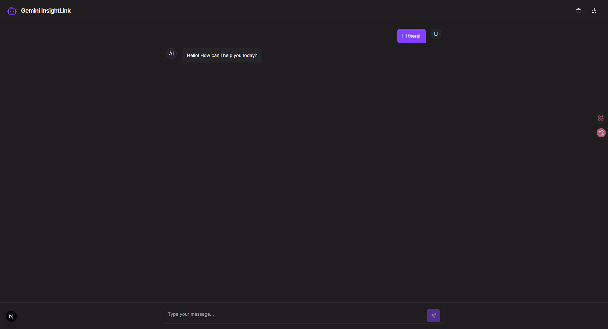

# Gemini InsightLink 🤖

A modern chatbot application built with **Next.js** (Frontend) and **FastAPI** (Backend), integrating Google Gemini AI with the ability to connect to Model Context Protocol (MCP) servers for dynamic tool execution.



## 🚀 Getting Started

This project can be run in two ways: locally for development or using Docker.

### 1. Local Development

**Prerequisites:**
- Node.js (v20 or later)
- Python (v3.9 or later)
- A Google Gemini API Key

#### Step 1: Configure Environment

1.  Create a `.env` file in the project root by copying the example:
    ```bash
    cp .env.example .env
    ```
2.  Edit the `.env` file and add your credentials:
    ```env
    # Your secret Gemini API Key
    GEMINI_API_KEY="your_gemini_api_key_here"

    # The port for the backend server
    NEXT_PUBLIC_BACKEND_PORT=8000
    ```

#### Step 2: Run the Backend

1.  Navigate to the backend directory and create a virtual environment:
    ```bash
    cd backend
    python -m venv venv
    ```
2.  Activate the virtual environment:
    ```bash
    # On Windows
    venv\Scripts\activate
    
    # On macOS/Linux
    source venv/bin/activate
    ```
3.  Install the required Python packages:
    ```bash
    pip install -r requirements.txt
    ```
4.  Start the backend server:
    ```bash
    python main.py
    ```
    The backend will be running at `http://localhost:8000` (or the port you specified).

#### Step 3: Run the Frontend

1.  In a **new terminal**, navigate to the project root.
2.  Install the Node.js dependencies:
    ```bash
    npm install
    ```
3.  Start the frontend development server:
    ```bash
    npm run dev
    ```
    The frontend will be available at `http://localhost:9002`.

---

### 2. Docker-Based Development

**Prerequisites:**
- Docker and Docker Compose
- A Google Gemini API Key

#### Step 1: Configure Environment

1.  Create a `.env` file from the template:
    ```bash
    cp .env.example .env
    ```
2.  Edit the `.env` file with your details. The same variables are used for the Docker setup.
    ```env
    GEMINI_API_KEY="your_gemini_api_key_here"
    NEXT_PUBLIC_BACKEND_PORT=8000
    ```

#### Step 2: Launch with Docker Compose

Build and start all services in detached mode:
```bash
docker compose up --build -d
```

#### Step 3: Access the Application

- **Frontend**: [http://localhost:9002](http://localhost:9002)
- **Backend API**: `http://localhost:8000` (or your specified port)
- **Backend Health Check**: `http://localhost:8000/health`

For more detailed Docker commands and troubleshooting, see [DOCKER.md](DOCKER.md).

## ✨ Features

- **Interactive Chat Interface**: Modern, clean, and intuitive UI with Markdown support.
- **Flexible Model Support**: Switch between Gemini models (`gemini-1.5-flash`, `gemini-1.5-pro`) and adjust parameters like temperature.
- **MCP Server Integration**: Dynamically add custom tool servers via URL, which are then available to the LangChain agent.
- **Smart Storage**: Chat history and settings are persisted in `localStorage`.
- **Modern Dark Theme**: A sleek dark theme for a great user experience.

## 📦 Tech Stack

- **Frontend**: Next.js, React, TypeScript, Tailwind CSS, Radix UI, Zustand, Framer Motion
- **Backend**: FastAPI, Python, LangChain, Google Generative AI
- **Containerization**: Docker & Docker Compose