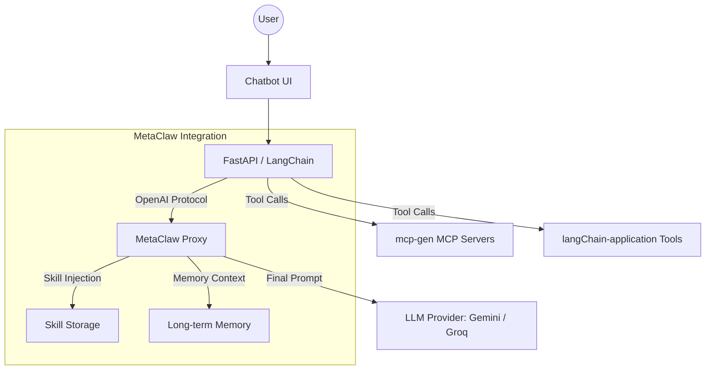
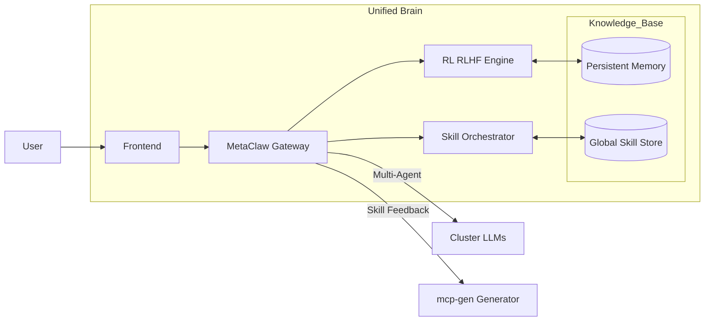

# MetaClaw Learning Proxy Integration

Tài liệu này ghi lại lộ trình tích hợp MetaClaw vào hệ thống Chatbot MCP hiện tại và các kiến trúc mục tiêu.

---

## 📋 Table of Contents

1. [Quick Start](#-quick-start)
2. [What is MetaClaw?](#-what-is-metaclaw)
3. [Integration Strategy Analysis](#-integration-strategy-analysis)
4. [Phase-by-Phase Implementation](#-phase-by-phase-implementation)
5. [Architecture Patterns](#-architecture-patterns)
6. [Component-Specific Integration](#-component-specific-integration)
7. [Testing & Validation](#-testing--validation)
8. [Configuration Reference](#-configuration-reference)
9. [Technical Notes](#-technical-notes)

---

## 🚀 Quick Start

**Minimum setup to get MetaClaw working:**

```bash
# 1. Install MetaClaw
pip install -e ".[evolve]"   # skills + auto-evolution
# or
pip install -e ".[rl,evolve,scheduler]"  # full RL + scheduler setup

# 2. One-time configuration
metaclaw setup               # wizard: choose agent, LLM provider, model

# 3. Start the proxy
metaclaw start --mode skills_only --port 30000

# 4. Point chatbot backend to MetaClaw
# Update .env: METACLAW_BASE_URL=http://localhost:30000/v1
```

---

## 🦞 What is MetaClaw?

MetaClaw is a **transparent learning proxy** that sits in front of any OpenAI-compatible LLM backend. It:

1. **Intercepts** every request/response through the proxy port (default `:30000/v1`)
2. **Injects skills** (Markdown files from `~/.metaclaw/skills/`) into system prompt at each turn
3. **Summarizes** conversations into new skills after each session
4. **Meta-learns** (optional RL) from live conversations via LoRA fine-tuning
5. **Persists memory** (v0.4.0) — facts, preferences, project state across sessions
6. **Supports multiple agents** — OpenClaw, CoPaw, IronClaw, PicoClaw, ZeroClaw, NanoClaw, NemoClaw, Hermes, or `none` (manual)

**Key insight:** MetaClaw should be inserted **between the LangChain Agent and the LLM Provider**, NOT between User and Frontend:

```
BEFORE (current):
chatbot_mcp_client backend
  └── LangChain Agent
        └── ChatGoogleGenerativeAI / ChatGroq  ──► Gemini/Groq API

AFTER (with MetaClaw):
chatbot_mcp_client backend
  └── LangChain Agent
        └── ChatOpenAI(base_url="http://localhost:30000/v1")  ──► MetaClaw Proxy
                                                                      │
                                                                      ├── Skill Injection
                                                                      ├── Memory Retrieval
                                                                      ▼
                                                                 Gemini/Groq/Any LLM API
```

---

## 🤔 Integration Strategy Analysis

### Where should MetaClaw be placed?

**Short answer:** NOT at the User↔Frontend layer, but at the **LLM Backend layer**.

### Three Integration Strategies

| Strategy | Complexity | Skill Injection | Memory | mcp-gen Integration | Best For |
|----------|------------|-----------------|--------|---------------------|----------|
| **Option A — LLM Proxy** | Low | Real-time ✅ | ✅ | Minimal | **Starting point** ✅ |
| **Option B — Sidecar** | Medium | After session ⚠️ | ❌ | Deep | Research |
| **Option C — Hybrid** | High | Real-time ✅ | ✅ | Deep + Bidirectional | **Scale up** 🚀 |

> **Recommendation:** Start with **Option A (Phase 1)** — only 5 lines of code change in `main.py`. Once verified, proceed to **Phase 2 (Skill Sync)** and **Phase 3 (Memory + RL)**.

---

## 📐 Phase-by-Phase Implementation

### Phase 1: LLM Proxy Integration (OpenAI-Compatible) ✅ PARTIALLY COMPLETE

_Mục tiêu: Thiết lập lớp proxy để Agent giao tiếp với LLM thông qua MetaClaw._

#### Status
- [x] **Backend Integration**: Add `metaclaw` provider to `main.py` using `ChatOpenAI` adapter
- [x] **Dependency**: Add `langchain-openai` to `requirements.txt`
- [x] **Env Config**: Add `METACLAW_API_KEY` and `METACLAW_BASE_URL` to `.env.example`
- [x] **Frontend UI**: Add MetaClaw option to Chat Settings, update `MODEL_CONFIG`
- [x] **Type Safety**: Update `ChatSettings` interface in `types.ts`
- [ ] **Local Setup**:
  - Install MetaClaw: `pip install -e ".[evolve]"`
  - Initialize: `metaclaw setup`
  - Start proxy: `metaclaw start --mode skills_only --port 30000`
- [ ] **langChain-application Integration**: Wire langChain LLM calls through MetaClaw proxy
- [ ] **mcp-gen Integration**: Route generation LLM calls through MetaClaw (optional)

#### Code Changes

**`chatbot_mcp_client/backend/main.py`:**
```python
# BEFORE:
llm = ChatGoogleGenerativeAI(model=model_name, api_key=api_key)

# AFTER (when MetaClaw is active):
from langchain_openai import ChatOpenAI

llm = ChatOpenAI(
    base_url=os.getenv("METACLAW_BASE_URL", "http://localhost:30000/v1"),
    api_key=os.getenv("METACLAW_API_KEY", "metaclaw"),  # local proxy
    model=model_name,
    temperature=0.7
)
```

**`.env` additions:**
```env
METACLAW_BASE_URL=http://localhost:30000/v1
METACLAW_API_KEY=metaclaw
METACLAW_ENABLED=true
```

#### Files to Modify
- `chatbot_mcp_client/backend/main.py`
- `chatbot_mcp_client/backend/requirements.txt`
- `chatbot_mcp_client/.env.example`
- `chatbot_mcp_client/src/lib/types.ts` (frontend types)
- `chatbot_mcp_client/src/components/ChatSettings.tsx` (UI)

---

### Phase 2: Skill Sync Bridge

_Mục tiêu: Tự động hóa việc đưa các skill sinh ra từ `mcp-gen` vào MetaClaw và ngược lại._

#### Status
- [ ] **Bridge Script**: Create `metaclaw-bridge.py` to read/write skill files
- [ ] **Format Conversion**: Convert tool/prompt templates to MetaClaw YAML/SKILL.md format
- [ ] **Sync Logic**: Copy converted files to/from `~/.metaclaw/skills/`
- [ ] **Auto-Reload**: Ensure MetaClaw detects new skills without restart (or trigger reload)
- [ ] **langChain-application Skill Loading**: Load MetaClaw skills into multi-agent pipeline
- [ ] **mcp-gen Skill Router Enhancement**: Import skills from MetaClaw into SKILLS.md

#### Architecture

```
┌─────────────────────────────────────────────────────────┐
│                   INTELLIGENCE LAYER                       │
│  metaclaw-bridge service                                   │
│   • Sync skills: mcp-gen/skills/ ↔ ~/.metaclaw/skills/   │
│   • Export conversation sessions → MetaClaw format        │
│   • Import evolved skills → mcp-gen SKILLS.md            │
└─────────────────────────────────────────────────────────┘
        │                           │
        ▼                           ▼
  MetaClaw Proxy              mcp-gen SkillRouter
  (LLM gateway)               (MCP generation)
```

#### Implementation Details

**`metaclaw-bridge.py` (create in `chatbot_mcp_client/backend/`):**
```python
"""
Bidirectional skill sync between MetaClaw and mcp-gen skill systems.
- Reads SKILL.md files from ~/.metaclaw/skills/
- Converts to mcp-gen skill format
- Copies to mcp-gen/src/skills/ directory
- Vice versa for mcp-gen → MetaClaw sync
"""
import os
import shutil
from pathlib import Path

METACLAW_SKILLS_DIR = Path.home() / ".metaclaw" / "skills"
MCP_GEN_SKILLS_DIR = Path(__file__).parent.parent.parent.parent / "mcp-gen" / "src" / "skills"

def sync_metaclaw_to_mcp_gen():
    """Copy MetaClaw skills to mcp-gen skill system."""
    # Implementation: read SKILL.md, convert format, write to mcp-gen/skills/
    pass

def sync_mcp_gen_to_metaclaw():
    """Copy mcp-gen skills to MetaClaw skill library."""
    # Implementation: read mcp-gen skills, convert to SKILL.md format
    pass

if __name__ == "__main__":
    sync_metaclaw_to_mcp_gen()
    sync_mcp_gen_to_metaclaw()
    print("Skill sync complete.")
```

#### langChain-application Integration

**Modify `my-agent/agents/generator.py`:**
```python
# Load MetaClaw skills at startup
METACLAW_SKILLS_DIR = Path.home() / ".metaclaw" / "skills"

def load_metaclaw_skills(task_type: str) -> list[str]:
    """Load relevant skills based on task type."""
    skills = []
    if METACLAW_SKILLS_DIR.exists():
        for skill_dir in METACLAW_SKILLS_DIR.iterdir():
            skill_file = skill_dir / "SKILL.md"
            if skill_file.exists():
                # Parse skill metadata (tags, applicability)
                # Filter by task_type relevance
                skills.append(skill_file.read_text())
    return skills

# Inject into generator prompt
skills_context = load_metaclaw_skills("mcp_generation")
```

#### Files to Create/Modify
- `chatbot_mcp_client/backend/metaclaw_bridge.py` (new)
- `langChain-application/my-agent/agents/generator.py` (modify)
- `langChain-application/my-agent/agents/examiner.py` (modify)
- `mcp-gen/src/skills/skill-router.ts` (enhance to read MetaClaw skills)

---

### Phase 3: Memory & RL (Continuous Evolution)

_Mục tiêu: Kích hoạt khả năng ghi nhớ dài hạn và học từ phản hồi người dùng._

#### Status
- [ ] **Persistence**: Configure MetaClaw to use Database (SQLite/PostgreSQL) for conversation storage
- [ ] **Feedback Loop**:
  - Frontend: Add Like/Dislike buttons for each message
  - Backend: Send feedback signals to MetaClaw via header or dedicated endpoint
- [ ] **RL Training**: Set up MetaClaw background job for prompt/skill fine-tuning based on accumulated feedback
- [ ] **Knowledge Graph**: (Optional) Connect MetaClaw with Vector DB for RAG through Proxy layer
- [ ] **Scheduler Configuration**: Enable sleep/idle/calendar-based training windows
- [ ] **OPD (On-Policy Distillation)**: Optional teacher model distillation for higher-quality generation

#### Memory Integration Architecture

```
User Chat Session
      │
      ▼
chatbot_mcp_client backend
      │
      ├──► MetaClaw Proxy (:30000)
      │         │
      │         ├── Memory Retrieval: Get relevant facts/preferences
      │         ├── Skill Injection: Add context-specific skills
      │         └── Memory Storage: Save conversation for consolidation
      │
      ▼
LLM Response
```

**Conversation Logger (`chatbot_mcp_client/backend/conversation_logger.py`):**
```python
"""
Logs conversations for MetaClaw memory and RL training.
Captures: user message, assistant response, tool calls, feedback signals.
"""
import json
from datetime import datetime
from pathlib import Path

class ConversationLogger:
    def __init__(self, log_dir: Path = Path("logs/conversations")):
        self.log_dir = log_dir
        self.log_dir.mkdir(parents=True, exist_ok=True)

    def log_turn(self, user_msg: str, assistant_msg: str, tools_used: list, feedback: dict = None):
        entry = {
            "timestamp": datetime.now().isoformat(),
            "user": user_msg,
            "assistant": assistant_msg,
            "tools": tools_used,
            "feedback": feedback
        }
        log_file = self.log_dir / f"{datetime.now().strftime('%Y-%m-%d')}.jsonl"
        with open(log_file, "a", encoding="utf-8") as f:
            f.write(json.dumps(entry, ensure_ascii=False) + "\n")
```

#### Frontend Feedback UI

**Add to message component:**
```tsx
// Feedback buttons for RL training
const [feedback, setFeedback] = useState<'like' | 'dislike' | null>(null);

const sendFeedback = async (type: 'like' | 'dislike') => {
  setFeedback(type);
  await fetch('/api/feedback', {
    method: 'POST',
    headers: { 'Content-Type': 'application/json' },
    body: JSON.stringify({ messageId, type, timestamp: Date.now() })
  });
};
```

#### RL Configuration

```bash
# Enable memory
metaclaw config memory.enabled true

# Full RL + scheduler setup
pip install -e ".[rl,evolve,scheduler]"

# Configure RL backend (Tinker/MinT/Weaver)
metaclaw config rl.backend tinker
metaclaw config rl.api_key sk-...
metaclaw config rl.model moonshotai/Kimi-K2.5

# Configure PRM (Process Reward Model)
metaclaw config rl.prm_url https://api.openai.com/v1
metaclaw config rl.prm_api_key sk-...

# Configure scheduler (auto mode)
metaclaw config scheduler.sleep_start "23:00"
metaclaw config scheduler.sleep_end "07:00"
metaclaw config scheduler.idle_threshold_minutes 30

# Start with auto mode (skills + RL + scheduler)
metaclaw start
```

#### Files to Create/Modify
- `chatbot_mcp_client/backend/conversation_logger.py` (new)
- `chatbot_mcp_client/src/components/MessageFeedback.tsx` (new)
- `chatbot_mcp_client/backend/main.py` (add feedback endpoint)
- `~/.metaclaw/config.yaml` (RL + memory configuration)

---

## 🏗️ Architecture Patterns

### Option A: MetaClaw as LLM Proxy (Current Implementation)



**Characteristics:**
- ✅ **Easy to deploy:** Only change `base_url` and `api_key` in Backend
- ✅ **Transparent:** LangChain Agent doesn't need to know about MetaClaw
- ✅ **Skill Injection:** MetaClaw auto-injects skills into prompt before sending to LLM
- ✅ **Memory Layer:** Remembers user preferences, project state across sessions

---

### Option C: Unified Agent Brain (Future Architecture)



**Characteristics:**
- 🎯 **Centralized:** MetaClaw becomes the "OS" of the Agent, not just a proxy
- 🔄 **Self-Evolution Loop:**
  1. Agent interacts with User → Results are evaluated
  2. MetaClaw learns from feedback via RL (Reinforcement Learning)
  3. Auto-calls `mcp-gen` to generate new skills or optimize existing ones
- 🌐 **Multi-Project Support:** One MetaClaw cluster serves multiple Frontends/Backends, sharing memory and skills

---

## 🔧 Component-Specific Integration

### 1. chatbot_mcp_client Integration

**Role:** Primary user interface, routes LLM calls through MetaClaw proxy

**Integration Points:**
- Replace LLM provider with MetaClaw endpoint (`ChatOpenAI`)
- Add conversation logger for RL training data
- Add feedback UI (Like/Dislike buttons)
- Preserve existing MCP tool execution (MetaClaw doesn't intercept tool calls)

**Health Check & Failover:**
```python
async def check_metaclaw_health():
    """Check if MetaClaw proxy is running."""
    try:
        async with httpx.AsyncClient() as client:
            resp = await client.get(f"{METACLAW_BASE_URL}/health", timeout=2.0)
            return resp.status_code == 200
    except Exception:
        return False

async def get_llm(model_name: str):
    """Get LLM instance with MetaClaw fallback."""
    if METACLAW_ENABLED and await check_metaclaw_health():
        return ChatOpenAI(
            base_url=METACLAW_BASE_URL,
            api_key=METACLAW_API_KEY,
            model=model_name
        )
    # Fallback to direct provider
    return ChatGoogleGenerativeAI(model=model_name, api_key=GEMINI_API_KEY)
```

---

### 2. langChain-application Integration

**Role:** Multi-agent MCP server generator (Supervisor/Generator/Examiner)

**Integration Points:**
- Load MetaClaw skills into Examiner Agent's RAG context
- Inject skills into Generator Agent prompts
- Share memory for project state and preferences
- Feed generation quality metrics back to MetaClaw's RL pipeline

**Supervisor Agent Enhancement:**
```python
# In my-agent/agents/supervisor.py
def get_context_with_metaclaw(request: str) -> str:
    """Enrich context with MetaClaw skills and memory."""
    base_context = retrieve_from_chroma(request)
    metaclaw_skills = load_metaclaw_skills(extract_task_type(request))
    metaclaw_memories = load_metaclaw_memories(request)

    enriched = base_context
    if metaclaw_skills:
        enriched += "\n\n## Relevant Skills:\n" + "\n".join(metaclaw_skills)
    if metaclaw_memories:
        enriched += "\n\n## Memory Context:\n" + "\n".join(metaclaw_memories)

    return enriched
```

**Quality Scoring for RL:**
```python
# After MCP server generation, score quality
def score_mcp_generation(server_id: str) -> dict:
    """Score generated MCP server for RL feedback."""
    return {
        "compilation_success": test_compilation(server_id),
        "test_pass_rate": run_tests(server_id),
        "api_coverage": measure_coverage(server_id),
        "code_quality": analyze_code_quality(server_id)
    }
    # Send score to MetaClaw's RL pipeline
```

---

### 3. mcp-gen Integration

**Role:** AI-driven API-to-MCP translator, generates MCP servers from API docs

**Integration Points:**
- Route generation LLM calls through MetaClaw proxy (optional)
- Import MetaClaw skills into Skill Router (`skill-router.ts`)
- Add quality scoring endpoint for RL feedback
- Sync skills bidirectionally with MetaClaw

**Enhanced Skill Router (`mcp-gen/src/skills/skill-router.ts`):**
```typescript
import { execSync } from 'child_process';
import * as fs from 'fs';
import * as path from 'path';

const METACLAW_SKILLS_DIR = process.env.HOME + '/.metaclaw/skills';

export async function loadMetaClawSkills(hasAuth: boolean): Promise<string[]> {
  const skills: string[] = [];

  if (fs.existsSync(METACLAW_SKILLS_DIR)) {
    const skillDirs = fs.readdirSync(METACLAW_SKILLS_DIR)
      .filter(dir => fs.statSync(path.join(METACLAW_SKILLS_DIR, dir)).isDirectory());

    for (const skillDir of skillDirs) {
      const skillFile = path.join(METACLAW_SKILLS_DIR, skillDir, 'SKILL.md');
      if (fs.existsSync(skillFile)) {
        const content = fs.readFileSync(skillFile, 'utf-8');
        // Parse and filter by relevance
        if (isSkillApplicable(content, hasAuth)) {
          skills.push(content);
        }
      }
    }
  }

  return skills;
}

// Integrate into prompt assembly
export async function assembleMCPSkillsWithMetaClaw(hasAuth: boolean): Promise<string> {
  const baseSkills = await assembleMCPSkills(hasAuth);
  const metaClawSkills = await loadMetaClawSkills(hasAuth);
  return baseSkills + '\n\n## Additional Skills from MetaClaw:\n' + metaClawSkills.join('\n\n');
}
```

**Quality Scoring Endpoint (`mcp-gen/src/mcp-server-manager.ts`):**
```typescript
// Add endpoint for RL feedback
app.post('/api/mcp/:serverId/quality', async (req, res) => {
  const { serverId } = req.params;
  const { compilation_success, test_pass_rate, api_coverage, code_quality } = req.body;

  // Store quality metrics in MongoDB
  await db.collection('server_quality').insertOne({
    serverId,
    metrics: { compilation_success, test_pass_rate, api_coverage, code_quality },
    timestamp: new Date()
  });

  // Optionally: send to MetaClaw's RL pipeline
  // await sendToMetaClawRL({ serverId, metrics });

  res.json({ status: 'recorded' });
});
```

---

## 🧪 Testing & Validation

### Test Suite Structure

**Create `tests/` directory at repository root:**

```
DoAnChuyenNganh/
└── tests/
    ├── test_metaclaw_integration.py    # Proxy routing, skills, memory
    ├── test_skills_injection.py         # Skills loading and sync
    ├── test_memory_persistence.py       # Cross-session memory
    ├── test_rl_pipeline.py              # RL training, feedback loop
    └── test_failover.py                 # Fallback when MetaClaw unavailable
```

### Test Checklist

#### 1. Proxy Routing Tests
- [ ] Verify chatbot → MetaClaw → LLM routing works
- [ ] Test skills injection in responses (compare with/without MetaClaw)
- [ ] Validate memory retrieval/injection across sessions
- [ ] Test streaming responses through proxy

#### 2. Skills Generation Tests
- [ ] Test skills loading in langChain-application
- [ ] Verify MCP server quality with/without skills
- [ ] Test auto-evolve after generation sessions
- [ ] Test bidirectional sync between mcp-gen and MetaClaw skills

#### 3. Memory Persistence Tests
- [ ] Verify cross-session memory recall (user preferences, project state)
- [ ] Test memory consolidation (every N sessions)
- [ ] Validate memory sidecar service (if using process isolation)
- [ ] Test memory injection into prompts

#### 4. RL Training Tests
- [ ] Test conversation sample collection
- [ ] Verify PRM scoring pipeline
- [ ] Test scheduler triggers (sleep/idle/calendar)
- [ ] Test feedback loop (Like/Disake → RL training signal)
- [ ] Test weight hot-swap during idle windows

#### 5. Integration Tests
- [ ] Full end-to-end: chat → skills → memory → MCP generation → RL
- [ ] Load testing with concurrent users
- [ ] Failover testing (proxy down, LLM unavailable)
- [ ] Docker Compose orchestration test

### Test Execution

```bash
# Run all tests
pytest tests/ -v

# Run specific test suite
pytest tests/test_metaclaw_integration.py -v

# Run with coverage
pytest tests/ --cov=backend --cov=my-agent --cov=mcp-gen
```

---

## ⚙️ Configuration Reference

### MetaClaw Configuration (`~/.metaclaw/config.yaml`)

```yaml
mode: auto                 # "auto" | "rl" | "skills_only"
claw_type: none            # "none" for manual wiring

llm:
  auth_method: api_key
  provider: kimi           # or qwen, openai, volcengine, custom
  model_id: moonshotai/Kimi-K2.5
  api_base: https://api.moonshot.cn/v1
  api_key: sk-...

proxy:
  port: 30000
  api_key: "metaclaw"      # bearer token for local proxy

skills:
  enabled: true
  dir: ~/.metaclaw/skills
  retrieval_mode: template  # template | embedding
  top_k: 6
  auto_evolve: true         # auto-summarize after each session

rl:
  enabled: false            # set to true for RL training
  backend: auto             # auto | tinker | mint | weaver
  model: moonshotai/Kimi-K2.5
  api_key: ""
  prm_url: https://api.openai.com/v1
  prm_model: gpt-5.2
  prm_api_key: ""

memory:
  enabled: false            # set to true for long-term memory
  top_k: 5
  max_tokens: 800
  retrieval_mode: hybrid    # keyword | semantic | hybrid

scheduler:
  enabled: false            # auto-enabled in auto mode
  sleep_start: "23:00"
  sleep_end: "07:00"
  idle_threshold_minutes: 30
```

### Chatbot `.env` Configuration

```env
# LLM Providers
GEMINI_API_KEY=your_gemini_api_key
GROQ_API_KEY=your_groq_api_key

# MetaClaw Integration
METACLAW_BASE_URL=http://localhost:30000/v1
METACLAW_API_KEY=metaclaw
METACLAW_ENABLED=true

# MCP Server Manager
MCP_MANAGER_URL=http://localhost:8080

# Backend
NEXT_PUBLIC_BACKEND_PORT=8000
```

### Docker Compose (Root Level - `docker-compose.full.yml`)

```yaml
version: '3.8'

services:
  # MetaClaw Proxy
  metaclaw:
    build:
      context: ./MetaClaw
      dockerfile: Dockerfile
    ports:
      - "30000:30000"
    volumes:
      - ~/.metaclaw:/root/.metaclaw
    environment:
      - METACLAW_CONFIG=/root/.metaclaw/config.yaml
    networks:
      - mcp-network

  # Chatbot Backend
  chatbot-backend:
    build:
      context: ./chatbot_mcp_client
      dockerfile: Dockerfile.backend
    ports:
      - "8000:8000"
    environment:
      - METACLAW_BASE_URL=http://metaclaw:30000/v1
      - GEMINI_API_KEY=${GEMINI_API_KEY}
    depends_on:
      - metaclaw
    networks:
      - mcp-network

  # mcp-gen Manager
  mcp-manager:
    build:
      context: ./mcp-gen
      dockerfile: Dockerfile.manager
    ports:
      - "8080:8080"
    networks:
      - mcp-network

  # mcp-gen Proxy
  mcp-proxy:
    build:
      context: ./mcp-gen
      dockerfile: Dockerfile.proxy
    ports:
      - "8081:8081"
    networks:
      - mcp-network

  # MongoDB (for mcp-gen)
  mongodb:
    image: mongo:latest
    ports:
      - "27017:27017"
    networks:
      - mcp-network

networks:
  mcp-network:
    external: true
```

---

## 📊 Trade-offs Analysis

| Aspect | Option A (LLM Proxy) | Option B (Sidecar) | Option C (Hybrid) |
|--------|---------------------|-------------------|-------------------|
| **Complexity** | Low | Medium | High |
| **Skill Injection** | Real-time ✅ | After session ⚠️ | Real-time ✅ |
| **Memory** | ✅ | ❌ | ✅ |
| **mcp-gen Integration** | Minimal | Deep | Deep + Bidirectional |
| **Production Risk** | Low | Low | Medium |
| **Deployment Time** | 10 min | 1 hour | 4+ hours |
| **Recommended for** | **Starting** ✅ | Research | **Scale up** 🚀 |

---

## 📝 Technical Notes

- **Port:** MetaClaw defaults to `30000`. Ensure no other service uses this port.
- **Compatibility:** Always follows OpenAI Chat Completions standard for interchangeability.
- **Skill Storage:** Located at `~/.metaclaw/skills/`. Each skill is a `SKILL.md` file.
- **Memory Storage:** Located at `~/.metaclaw/memory/` (configurable via `memory.store_path`).
- **Config Location:** `~/.metaclaw/config.yaml` (created by `metaclaw setup`).
- **Network:** All Docker services should connect to `mcp-network` for cross-container communication.
- **Fallback:** Always implement fallback to direct LLM provider if MetaClaw is unavailable.

### CLI Commands Reference

```bash
# MetaClaw CLI
metaclaw setup                  # Interactive first-time configuration
metaclaw start                  # Start proxy (default: auto mode)
metaclaw start --mode rl        # Force RL mode (no scheduler)
metaclaw start --mode skills_only  # Force skills-only mode
metaclaw stop                   # Stop running instance
metaclaw status                 # Check health and mode
metaclaw config show            # View current config
metaclaw config KEY VALUE       # Set config value
metaclaw auth paste-token --provider anthropic  # Store OAuth token
```

### Troubleshooting

| Issue | Solution |
|-------|----------|
| MetaClaw won't start on port 30000 | Check for conflicts: `netstat -ano | findstr :30000` |
| Skills not injecting | Verify `~/.metaclaw/skills/` has valid `SKILL.md` files |
| Memory not persisting | Ensure `memory.enabled=true` in config |
| LangChain timeout through proxy | Increase timeout in `ChatOpenAI` initialization |
| RL training not starting | Check `rl.enabled=true` and valid backend credentials |

---

## 📚 Related Documentation

- [MetaClaw Proposal](./METACLAW_PROPOSAL.md) - Detailed architecture and strategy analysis
- [MetaClaw Official README](../../MetaClaw/README.md) - Upstream documentation
- [chatbot_mcp_client README](../README.md) - Chatbot system documentation
- [langChain-application README](../../langChain-application/README.md) - Multi-agent system docs
- [mcp-gen README](../../mcp-gen/README.md) - MCP generator documentation

---

**Last Updated:** 2026-04-13
**Status:** Phase 1 Partially Complete ✅ | Phase 2 Planned 📋 | Phase 3 Planned 📋
