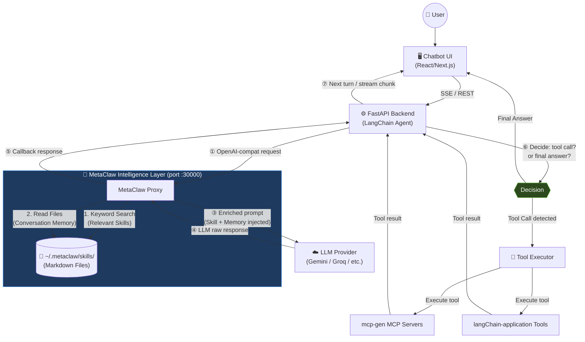
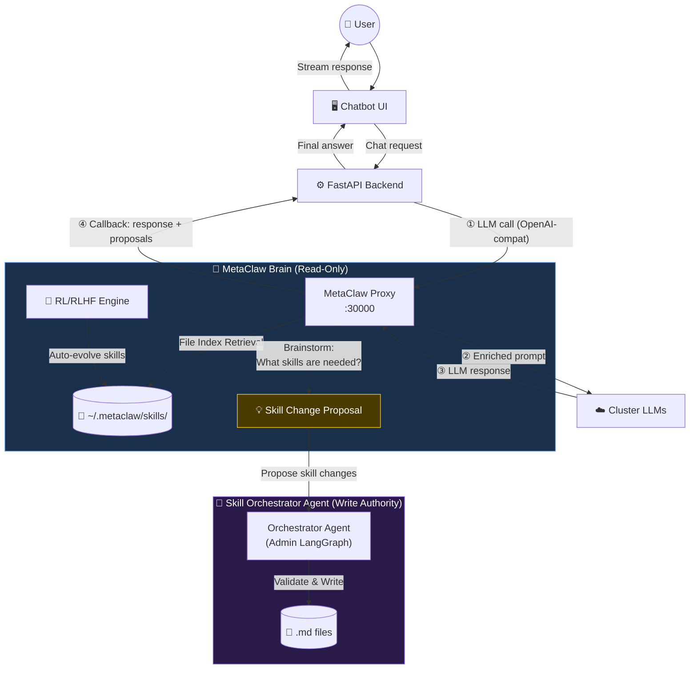

# MetaClaw Learning Proxy Integration

Tài liệu này ghi lại lộ trình tích hợp MetaClaw vào hệ thống Chatbot MCP hiện tại và các kiến trúc mục tiêu.

---

## 📋 Table of Contents

1. [Quick Start](#-quick-start)
2. [What is MetaClaw?](#-what-is-metaclaw)
3. [Integration Strategy Analysis](#-integration-strategy-analysis)
4. [Phase-by-Phase Implementation](#-phase-by-phase-implementation)
5. [Architecture Patterns](#-architecture-patterns)
6. [Component-Specific Integration](#-component-specific-integration)
7. [Testing & Validation](#-testing--validation)
8. [Configuration Reference](#-configuration-reference)
9. [Technical Notes](#-technical-notes)

---

## 🚀 Quick Start

**Minimum setup to get MetaClaw working:**

```bash
# 1. Install MetaClaw
pip install -e ".[evolve]"   # skills + auto-evolution
# or
pip install -e ".[rl,evolve,scheduler]"  # full RL + scheduler setup

# 2. One-time configuration
metaclaw setup               # wizard: choose agent, LLM provider, model

# 3. Start the proxy
metaclaw start --mode skills_only --port 30000

# 4. Point chatbot backend to MetaClaw
# Update .env: METACLAW_BASE_URL=http://localhost:30000/v1
```

---

## 🦞 What is MetaClaw?

MetaClaw is a **transparent learning proxy** that sits in front of any OpenAI-compatible LLM backend. It:

1. **Intercepts** every request/response through the proxy port (default `:30000/v1`)
2. **Injects skills** (Markdown files from `~/.metaclaw/skills/`) into system prompt at each turn
3. **Summarizes** conversations into new skills after each session
4. **Meta-learns** (optional RL) from live conversations via LoRA fine-tuning
5. **Persists memory** (v0.4.0) — facts, preferences, project state across sessions
6. **Supports multiple agents** — OpenClaw, CoPaw, IronClaw, PicoClaw, ZeroClaw, NanoClaw, NemoClaw, Hermes, or `none` (manual)

**Key insight:** MetaClaw should be inserted **between the LangChain Agent and the LLM Provider**, NOT between User and Frontend:

```
BEFORE (current):
chatbot_mcp_client backend
  └── LangChain Agent
        └── ChatGoogleGenerativeAI / ChatGroq  ──► Gemini/Groq API

AFTER (with MetaClaw):
chatbot_mcp_client backend
  └── LangChain Agent
        └── ChatOpenAI(base_url="http://localhost:30000/v1")  ──► MetaClaw Proxy
                                                                      │
                                                                      ├── Skill Injection
                                                                      ├── Memory Retrieval
                                                                      ▼
                                                                 Gemini/Groq/Any LLM API
```

---

## 🤔 Integration Strategy Analysis

### Where should MetaClaw be placed?

**Short answer:** NOT at the User↔Frontend layer, but at the **LLM Backend layer**.

### Three Integration Strategies

| Strategy                 | Complexity | Skill Injection  | Memory | mcp-gen Integration  | Best For              |
| ------------------------ | ---------- | ---------------- | ------ | -------------------- | --------------------- |
| **Option A — LLM Proxy** | Low        | Real-time ✅     | ✅     | Minimal              | **Starting point** ✅ |
| **Option B — Sidecar**   | Medium     | After session ⚠️ | ❌     | Deep                 | Research              |
| **Option C — Hybrid**    | High       | Real-time ✅     | ✅     | Deep + Bidirectional | **Scale up** 🚀       |

> **Recommendation:** Start with **Option A (Phase 1)** — only 5 lines of code change in `main.py`. Once verified, proceed to **Phase 2 (Skill Sync)** and **Phase 3 (Memory + RL)**.

---

## 📐 Phase-by-Phase Implementation

### Phase 1: LLM Proxy Integration (OpenAI-Compatible) ✅ PARTIALLY COMPLETE

_Mục tiêu: Thiết lập lớp proxy để Agent giao tiếp với LLM thông qua MetaClaw._

#### Status

- [x] **Backend Integration**: Add `metaclaw` provider to `main.py` using `ChatOpenAI` adapter
- [x] **Dependency**: Add `langchain-openai` to `requirements.txt`
- [x] **Env Config**: Add `METACLAW_API_KEY` and `METACLAW_BASE_URL` to `.env.example`
- [x] **Frontend UI**: Add MetaClaw option to Chat Settings, update `MODEL_CONFIG`
- [x] **Type Safety**: Update `ChatSettings` interface in `types.ts`
- [ ] **Local Setup**:
  - Install MetaClaw: `pip install -e ".[evolve]"`
  - Initialize: `metaclaw setup`
  - Start proxy: `metaclaw start --mode skills_only --port 30000`
- [ ] **langChain-application Integration**: Wire langChain LLM calls through MetaClaw proxy
- [ ] **mcp-gen Integration**: Route generation LLM calls through MetaClaw (optional)

#### Code Changes

**`chatbot_mcp_client/backend/main.py`:**

```python
# BEFORE:
llm = ChatGoogleGenerativeAI(model=model_name, api_key=api_key)

# AFTER (when MetaClaw is active):
from langchain_openai import ChatOpenAI

llm = ChatOpenAI(
    base_url=os.getenv("METACLAW_BASE_URL", "http://localhost:30000/v1"),
    api_key=os.getenv("METACLAW_API_KEY", "metaclaw"),  # local proxy
    model=model_name,
    temperature=0.7
)
```

**`.env` additions:**

```env
METACLAW_BASE_URL=http://localhost:30000/v1
METACLAW_API_KEY=metaclaw
METACLAW_ENABLED=true
```

#### Files to Modify

- `chatbot_mcp_client/backend/main.py`
- `chatbot_mcp_client/backend/requirements.txt`
- `chatbot_mcp_client/.env.example`
- `chatbot_mcp_client/src/lib/types.ts` (frontend types)
- `chatbot_mcp_client/src/components/ChatSettings.tsx` (UI)

---

### Phase 2: File-Based Knowledge Bootstrapping

_Mục tiêu: Đưa toàn bộ tri thức từ mcp-gen vào MetaClaw qua Hard Copy._

#### Knowledge Bootstrapping (File Copy)

Để MetaClaw có thể tư vấn thông minh, chúng ta đẩy các tài liệu dạng file Markdown vào MetaClaw:

1. **Sync / Copy:** Thực hiện sao chép các file thư mục `mcp-gen/docs` vào thư mục `~/.metaclaw/skills/`.
2. **Template Discovery:** MetaClaw sử dụng keyword và regex (Template Retrieval) để quét các file tri thức, qua đó tìm những nội dung liên quan nhất để đưa vào prompt của người dùng.

#### Status

- [ ] **Folder Structure Setup**: Tạo thư mục skills trên máy local.
- [ ] **Hard Copy Script**: Viết và chạy script để nạp dữ liệu từ `mcp-gen/docs/` vào `~/.metaclaw/skills`.
- [ ] **mcp-gen Proxy Routing**: Cấu hình mcp-gen sử dụng MetaClaw làm LLM endpoint để tận dụng tri thức này.
- [ ] **Skill Awareness**: Kiểm chứng việc MetaClaw quét và nhận diện đúng file skill khi người dùng hoặc mcp-gen thao tác.

#### Architecture

```
┌─────────────────────────────────────────────────────────┐
│                   INTELLIGENCE LAYER                       │
│  MetaClaw Proxy (port :30000)                              │
│   • Acts as "Brain" for both Chatbot and mcp-gen          │
│   • Dynamic Skill Injection for every LLM call            │
│   • No file sync needed - single source of truth          │
└─────────────────────────────────────────────────────────┘
        │                           │
        ▼                           ▼
   Chatbot Backend             mcp-gen Generator
   (Uses MetaClaw API)         (Uses MetaClaw API)
```

#### Implementation Details (No-Sync Approach)

**Cấu hình mcp-gen sử dụng MetaClaw:**
Trong file cấu hình của mcp-gen (hoặc thông qua environment variables), thiết lập LLM trỏ về MetaClaw Proxy thay vì gọi trực tiếp Gemini API.

```typescript
// mcp-gen/src/services/llm.ts
const llm = new ChatOpenAI({
  baseUrl: process.env.METACLAW_BASE_URL || "http://localhost:30000/v1",
  apiKey: process.env.METACLAW_API_KEY || "metaclaw",
  modelName: "gemini-1.5-pro",
});
```

**Lợi ích:**

- Khi mcp-gen gửi prompt tạo server, MetaClaw sẽ chặn lại, tìm trong `~/.metaclaw/skills/` những skill liên quan đến việc viết code MCP, Auth, hoặc API patterns và inject vào prompt.
- Kết quả trả về cho mcp-gen là code đã được tối ưu dựa trên toàn bộ kiến thức MetaClaw đang có.

#### Files to Create/Modify

- `mcp-gen/src/services/llm.ts` (redirect to proxy)
- `mcp-gen/.env` (add METACLAW vars)
- `langChain-application/my-agent/agents/generator.py` (redirect to proxy)

---

### Phase 3: Memory & RL (Continuous Evolution via File System)

_Mục tiêu: Kích hoạt khả năng ghi nhớ dài hạn và học từ phản hồi người dùng thông qua File Storage._

#### Status

- [ ] **Text Persistence**: Cấu hình MetaClaw lưu trữ sự kiện/fact vào các file memory.
- [ ] **Feedback Loop**: Thu thập tín hiệu Like/Dislike để phản hồi RL.
- [ ] **RL Training**: MetaClaw tinh chỉnh (fine-tune) prompt và skill.
- [ ] **Keyword Search**: Bật tìm kiếm tri thức qua folder.

#### Memory Integration Architecture

```
User Chat Session
      │
      ▼
chatbot_mcp_client backend
      │
      ├──► MetaClaw Proxy (:30000)
      │         │
      │         ├── 🔎 Read Disk: Lấy facts/skills phù hợp nhất
      │         ├── 💉 Injection: Chèn context vào prompt
      │         └── 💾 Write Disk: Lưu hội thoại vào thư mục memory
      │
      ▼
LLM Response
```

**Conversation Logger (`chatbot_mcp_client/backend/conversation_logger.py`):**

```python
"""
Logs conversations for MetaClaw memory and RL training.
Captures: user message, assistant response, tool calls, feedback signals.
"""
import json
from datetime import datetime
from pathlib import Path

class ConversationLogger:
    def __init__(self, log_dir: Path = Path("logs/conversations")):
        self.log_dir = log_dir
        self.log_dir.mkdir(parents=True, exist_ok=True)

    def log_turn(self, user_msg: str, assistant_msg: str, tools_used: list, feedback: dict = None):
        entry = {
            "timestamp": datetime.now().isoformat(),
            "user": user_msg,
            "assistant": assistant_msg,
            "tools": tools_used,
            "feedback": feedback
        }
        log_file = self.log_dir / f"{datetime.now().strftime('%Y-%m-%d')}.jsonl"
        with open(log_file, "a", encoding="utf-8") as f:
            f.write(json.dumps(entry, ensure_ascii=False) + "\n")
```

#### Frontend Feedback UI

**Add to message component:**

```tsx
// Feedback buttons for RL training
const [feedback, setFeedback] = useState<"like" | "dislike" | null>(null);

const sendFeedback = async (type: "like" | "dislike") => {
  setFeedback(type);
  await fetch("/api/feedback", {
    method: "POST",
    headers: { "Content-Type": "application/json" },
    body: JSON.stringify({ messageId, type, timestamp: Date.now() }),
  });
};
```

#### RL Configuration

```bash
# Enable memory
metaclaw config memory.enabled true

# Full RL + scheduler setup
pip install -e ".[rl,evolve,scheduler]"

# Configure RL backend (Tinker/MinT/Weaver)
metaclaw config rl.backend tinker
metaclaw config rl.api_key sk-...
metaclaw config rl.model moonshotai/Kimi-K2.5

# Configure PRM (Process Reward Model)
metaclaw config rl.prm_url https://api.openai.com/v1
metaclaw config rl.prm_api_key sk-...

# Configure scheduler (auto mode)
metaclaw config scheduler.sleep_start "23:00"
metaclaw config scheduler.sleep_end "07:00"
metaclaw config scheduler.idle_threshold_minutes 30

# Start with auto mode (skills + RL + scheduler)
metaclaw start
```

#### Files to Create/Modify

- `chatbot_mcp_client/backend/conversation_logger.py` (new)
- `chatbot_mcp_client/src/components/MessageFeedback.tsx` (new)
- `chatbot_mcp_client/backend/main.py` (add feedback endpoint)
- `~/.metaclaw/config.yaml` (RL + memory configuration)

---

## 🏗️ Architecture Patterns

### Option A: MetaClaw as LLM Proxy (Current Implementation)

> **Luồng hoạt động chính xác:** MetaClaw không chỉ là pass-through — sau khi nhận response từ LLM, MetaClaw **callback về Backend** để Backend quyết định xử lý (tool calls, routing, streaming).



**Đặc điểm quan trọng:**

- ✅ **MetaClaw chỉ enriches prompt** — inject skills + memory trước khi gửi LLM
- ✅ **Callback về Backend** — response (kể cả `tool_calls`) được trả về Backend, Backend mới quyết định
- ✅ **Backend là decision-maker** — xem có tool call không, có cần gọi MCP không
- ✅ **MetaClaw transparent với LangChain** — chỉ cần đổi `base_url`
- ⚠️ **MetaClaw không tự thực thi tool** — nó chỉ là proxy, không can thiệp vào tool execution

---

### Option C: Unified Agent Brain (Future Architecture)

> **Nguyên tắc cốt lõi:** MetaClaw là **read-only brain** — nó suy nghĩ, đề xuất, brainstorm — nhưng **không thể tự chỉnh sửa skill, không thể tự push code vào mcp-gen**. Cần một **Skill Orchestrator Agent** chuyên biệt đứng ra thực thi mọi thay đổi.



**Luồng quan trọng được làm rõ:**

| Luồng                              | Mô tả                                                                                                 |
| ---------------------------------- | ----------------------------------------------------------------------------------------------------- |
| **User → mcp-gen qua MetaClaw**    | Mọi LLM call trong mcp-gen đều đi qua MetaClaw proxy (port :30000) để được inject skills              |
| **MetaClaw → Backend callback**    | Sau khi LLM trả lời, MetaClaw callback về Backend — Backend mới quyết định tool call hay final answer |
| **MetaClaw brainstorm → Proposal** | MetaClaw chỉ _đề xuất_ skill cần thêm/sửa, không tự thực thi                                          |
| **Orchestrator Agent thực thi**    | Một Agent chuyên biệt (Admin LangGraph) validate và viết skill vào Skill Store + sync với mcp-gen     |
| **RL Feedback loop**               | Quality score từ mcp-gen + feedback từ user → RL Engine → cải thiện MetaClaw model                    |

**Đặc điểm:**

- 🎯 **MetaClaw = Read-Only Brain:** Brainstorm, propose, nhưng không tự write file hay push code
- 🤖 **Orchestrator Agent = Write Authority:** Agent riêng biệt, có quyền add/update/delete skills
- 🔗 **mcp-gen luôn qua MetaClaw proxy:** Đảm bảo skill injection cho mọi LLM call trong hệ thống
- 🔄 **Skill Sync có kiểm soát:** Orchestrator validate trước khi sync, tránh propagate lỗi
- 🌐 **Multi-Project:** Một MetaClaw cluster phục vụ nhiều Frontend/Backend, share memory + skills

---

## 🔧 Component-Specific Integration

### 1. chatbot_mcp_client Integration

**Role:** Primary user interface, routes LLM calls through MetaClaw proxy

**Integration Points:**

- Replace LLM provider with MetaClaw endpoint (`ChatOpenAI`)
- Add conversation logger for RL training data
- Add feedback UI (Like/Dislike buttons)
- Preserve existing MCP tool execution (MetaClaw doesn't intercept tool calls)

**Health Check & Failover:**

```python
async def check_metaclaw_health():
    """Check if MetaClaw proxy is running."""
    try:
        async with httpx.AsyncClient() as client:
            resp = await client.get(f"{METACLAW_BASE_URL}/health", timeout=2.0)
            return resp.status_code == 200
    except Exception:
        return False

async def get_llm(model_name: str):
    """Get LLM instance with MetaClaw fallback."""
    if METACLAW_ENABLED and await check_metaclaw_health():
        return ChatOpenAI(
            base_url=METACLAW_BASE_URL,
            api_key=METACLAW_API_KEY,
            model=model_name
        )
    # Fallback to direct provider
    return ChatGoogleGenerativeAI(model=model_name, api_key=GEMINI_API_KEY)
```

---

### 2. langChain-application Integration

**Role:** Multi-agent MCP server generator (Supervisor/Generator/Examiner)

#### ⚠️ Vấn đề với luồng tuần tự hiện tại

Luồng hiện tại `Supervisor → Examiner → Generator → mcp-gen` có những điểm yếu cốt lõi:

| Vấn đề | Mô tả |
|--------|-------|
| **Mỗi agent tự init LLM riêng** | `supervisor.py`, `examiner_agent.py`, `generator_agent.py` đều `new ChatGoogleGenerativeAI(...)` độc lập → MetaClaw không có điểm vào để inject |
| **Không có vòng lặp động** | Supervisor gọi `ainvoke` 1 lần rồi return, không thể re-route nếu Generator thất bại |
| **mcp-gen là endpoint cứng** | mcp-gen luôn là bước cuối của pipeline, không thể skip hay retry với context khác |

#### ✅ Giải pháp: `llm_factory.py` — Single Entry Point cho MetaClaw

Thay vì mỗi agent tự khởi tạo LLM, tạo một factory trung tâm. Đây là thay đổi **nhỏ nhất nhưng ảnh hưởng lớn nhất** — ngay lập tức toàn bộ hệ thống được MetaClaw inject skill.

**Tạo file `my-agent/utils/llm_factory.py`:**

```python
import os
from langchain_core.language_models import BaseChatModel

def get_llm(model_name: str, temperature: float = 0.7) -> BaseChatModel:
    """
    Central LLM factory. All agents MUST use this function.
    Routes through MetaClaw proxy when enabled; falls back to direct provider.
    """
    metaclaw_enabled = os.getenv("METACLAW_ENABLED", "false").lower() == "true"
    metaclaw_url = os.getenv("METACLAW_BASE_URL", "http://localhost:30000/v1")
    metaclaw_key = os.getenv("METACLAW_API_KEY", "metaclaw")
    
    if metaclaw_enabled:
        from langchain_openai import ChatOpenAI
        print(f"[LLM Factory] 🧠 Routing through MetaClaw proxy: {metaclaw_url}")
        return ChatOpenAI(
            base_url=metaclaw_url,
            api_key=metaclaw_key,
            model=model_name,
            temperature=temperature
        )
    
    # Fallback: direct Gemini
    from langchain_google_genai import ChatGoogleGenerativeAI
    from pydantic import SecretStr
    api_key = SecretStr(os.getenv("GEMINI_API_KEY", ""))
    print(f"[LLM Factory] ⚡ MetaClaw disabled. Using Gemini directly.")
    return ChatGoogleGenerativeAI(model=model_name, api_key=api_key, temperature=temperature)
```

**Cập nhật tất cả agent dùng factory:**

```python
# BEFORE (supervisor.py, examiner_agent.py, generator_agent.py):
from langchain_google_genai import ChatGoogleGenerativeAI
llm = ChatGoogleGenerativeAI(model=config["model"], api_key=api_key)

# AFTER:
from utils.llm_factory import get_llm
llm = get_llm(config["model"])
```

> **Lợi ích tức thì:** MetaClaw tự động inject skill mcp-generation, auth patterns, code quality vào TỪNG agent call (Examiner dùng skill để phân tích API, Generator dùng skill để viết code chuẩn). Không cần thêm bất kỳ logic manual nào.

#### ✅ Giải pháp: Dynamic Routing trong Supervisor

Thay vì hardcode `examiner → generator`, Supervisor dùng LLM (đã qua MetaClaw) để **quyết định next step** sau mỗi turn:

```python
# my-agent/agents/supervisor.py
from utils.llm_factory import get_llm

class SupervisorAgent:
    def __init__(self):
        config = AGENT_CONFIG["supervisor"]
        # 🔑 Dùng factory thay vì init trực tiếp
        self.model = get_llm(config["model"])
        self.model_with_tools = self.model.bind_tools(SUPERVISOR_TOOLS)

    async def route(self, state: GraphState) -> str:
        """
        MetaClaw-enriched routing: LLM tự quyết định agent nào xử lý tiếp.
        MetaClaw proxy đã inject skill routing patterns phù hợp vào system prompt.
        """
        history_summary = "\n".join([
            f"- {m.type}: {str(m.content)[:100]}" for m in state["messages"][-5:]
        ])
        decision_prompt = f"""Current task: {state.get('task', 'N/A')}
Work done so far:
{history_summary}

Available agents: [examiner, generator, validator, done]
Which agent should handle next? Reply with ONLY the agent name."""
        response = await self.model.ainvoke([HumanMessage(content=decision_prompt)])
        next_agent = response.content.strip().lower()
        print(f"[Supervisor] 🧭 Routing to: {next_agent}")
        return next_agent
```

**Cập nhật LangGraph graph để dùng conditional edges:**

```python
# my-agent/graph.py hoặc tương đương
workflow = StateGraph(AgentState)
workflow.add_node("supervisor", supervisor_node)
workflow.add_node("examiner", examiner_agent_node)
workflow.add_node("generator", generator_agent_node)

# Conditional routing thay vì forced sequence
workflow.add_conditional_edges(
    "supervisor",
    lambda state: state["next_agent"],  # Supervisor tự quyết định
    {"examiner": "examiner", "generator": "generator", "done": END}
)
# Sau khi Examiner/Generator xong → quay lại Supervisor để quyết định tiếp
workflow.add_edge("examiner", "supervisor")
workflow.add_edge("generator", "supervisor")
```

#### ✅ Giải pháp: mcp-gen as Tool (không phải Pipeline Step)

Thay vì mcp-gen là endpoint cứng cuối pipeline, expose nó như một LangChain Tool:

```python
# my-agent/tools/mcp_gen_tool.py
from langchain_core.tools import tool
import httpx

@tool
async def build_mcp_server(api_spec: str, user_id: str) -> dict:
    """Build an MCP server from an OpenAPI specification.
    Use this tool when the user wants to create/generate an MCP server."""
    async with httpx.AsyncClient(timeout=300) as client:
        response = await client.post(
            "http://localhost:8080/api/generate",
            json={"spec": api_spec, "userId": user_id}
        )
        return response.json()
```

Với cách này, Orchestrator có thể gọi `build_mcp_server` bao nhiêu lần tùy thích, retry khi thất bại, hoặc skip hoàn toàn nếu không cần.

**Quality Scoring for RL:**

```python
# After MCP server generation, score quality and send to MetaClaw RL pipeline
async def score_and_report(server_id: str):
    """Score generated MCP server for RL feedback."""
    metrics = {
        "compilation_success": await test_compilation(server_id),
        "test_pass_rate": await run_tests(server_id),
        "api_coverage": await measure_coverage(server_id),
        "code_quality": await analyze_code_quality(server_id)
    }
    # Send score to mcp-gen's RL metrics endpoint
    async with httpx.AsyncClient() as client:
        await client.post(
            f"http://localhost:8080/api/mcp/{server_id}/quality",
            json=metrics
        )
    return metrics
```

**Files cần tạo/sửa:**

- `my-agent/utils/llm_factory.py` **[NEW]** — Central LLM factory
- `my-agent/agents/supervisor.py` **[MODIFY]** — Dùng factory, thêm dynamic routing
- `my-agent/agents/sub_agents/examiner_agent.py` **[MODIFY]** — Dùng factory
- `my-agent/agents/sub_agents/generator_agent.py` **[MODIFY]** — Dùng factory
- `my-agent/tools/mcp_gen_tool.py` **[NEW]** — mcp-gen exposed as Tool
- `langChain-application/.env` **[MODIFY]** — Thêm METACLAW vars


### 3. mcp-gen Integration

**Role:** AI-driven API-to-MCP translator, generates MCP servers from API docs.

**Integration Points:**

- **Route LLM calls through MetaClaw proxy**: mcp-gen không tự quản lý skill mà gửi yêu cầu qua MetaClaw. MetaClaw sẽ inject context phù hợp (ví dụ: "Sử dụng thư viện X", "Cấu trúc file Y") dựa trên request của mcp-gen.
- **Remove local skill management**: mcp-gen trở nên lightweight, tập trung vào generator logic.
- **RL Feedback**: Trả về thông số chất lượng của server được gen (compilation, tests) cho MetaClaw học.

**Cấu hình mcp-gen trỏ LLM về Proxy:**

```typescript
// Trong mcp-gen/src/config.ts hoặc tương đương
export const LLM_CONFIG = {
  baseURL: process.env.METACLAW_BASE_URL || "http://localhost:30000/v1",
  apiKey: process.env.METACLAW_API_KEY || "metaclaw",
  model: "gemini-2.5-flash",
};
```

**Quality Scoring Endpoint (`mcp-gen/src/mcp-server-manager.ts`):**

```typescript
// Add endpoint for RL feedback
app.post("/api/mcp/:serverId/quality", async (req, res) => {
  const { serverId } = req.params;
  const { compilation_success, test_pass_rate, api_coverage, code_quality } =
    req.body;

  // Store quality metrics in MongoDB
  await db.collection("server_quality").insertOne({
    serverId,
    metrics: {
      compilation_success,
      test_pass_rate,
      api_coverage,
      code_quality,
    },
    timestamp: new Date(),
  });

  // Optionally: send to MetaClaw's RL pipeline
  // await sendToMetaClawRL({ serverId, metrics });

  res.json({ status: "recorded" });
});
```

---

## 🧪 Testing & Validation

### Test Suite Structure

**Create `tests/` directory at repository root:**

```
DoAnChuyenNganh/
└── tests/
    ├── test_metaclaw_integration.py    # Proxy routing, skills, memory
    ├── test_skills_injection.py         # Skills loading and sync
    ├── test_memory_persistence.py       # Cross-session memory
    ├── test_rl_pipeline.py              # RL training, feedback loop
    └── test_failover.py                 # Fallback when MetaClaw unavailable
```

### Test Checklist

#### 1. Proxy Routing Tests

- [ ] Verify chatbot → MetaClaw → LLM routing works
- [ ] Test skills injection in responses (compare with/without MetaClaw)
- [ ] Validate memory retrieval/injection across sessions
- [ ] Test streaming responses through proxy

#### 2. Skills Generation Tests

- [ ] Test skills loading in langChain-application
- [ ] Verify MCP server quality with/without skills
- [ ] Test auto-evolve after generation sessions
- [ ] Test bidirectional sync between mcp-gen and MetaClaw skills

#### 3. Memory Persistence Tests

- [ ] Verify cross-session memory recall (user preferences, project state)
- [ ] Test memory consolidation (every N sessions)
- [ ] Validate memory sidecar service (if using process isolation)
- [ ] Test memory injection into prompts

#### 4. RL Training Tests

- [ ] Test conversation sample collection
- [ ] Verify PRM scoring pipeline
- [ ] Test scheduler triggers (sleep/idle/calendar)
- [ ] Test feedback loop (Like/Disake → RL training signal)
- [ ] Test weight hot-swap during idle windows

#### 5. Integration Tests

- [ ] Full end-to-end: chat → skills → memory → MCP generation → RL
- [ ] Load testing with concurrent users
- [ ] Failover testing (proxy down, LLM unavailable)
- [ ] Docker Compose orchestration test

### Test Execution

```bash
# Run all tests
pytest tests/ -v

# Run specific test suite
pytest tests/test_metaclaw_integration.py -v

# Run with coverage
pytest tests/ --cov=backend --cov=my-agent --cov=mcp-gen
```

---

## ⚙️ Configuration Reference

### MetaClaw Configuration (`~/.metaclaw/config.yaml`)

```yaml
mode: auto # "auto" | "rl" | "skills_only"
claw_type: none # "none" for manual wiring

llm:
  auth_method: api_key
  provider: kimi # or qwen, openai, volcengine, custom
  model_id: moonshotai/Kimi-K2.5
  api_base: https://api.moonshot.cn/v1
  api_key: sk-...

proxy:
  port: 30000
  api_key: "metaclaw" # bearer token for local proxy

skills:
  enabled: true
  dir: ~/.metaclaw/skills
  retrieval_mode: template # template | embedding
  top_k: 6
  auto_evolve: true # auto-summarize after each session

rl:
  enabled: false # set to true for RL training
  backend: auto # auto | tinker | mint | weaver
  model: moonshotai/Kimi-K2.5
  api_key: ""
  prm_url: https://api.openai.com/v1
  prm_model: gpt-5.2
  prm_api_key: ""

memory:
  enabled: false # set to true for long-term memory
  top_k: 5
  max_tokens: 800
  retrieval_mode: hybrid # keyword | semantic | hybrid

scheduler:
  enabled: false # auto-enabled in auto mode
  sleep_start: "23:00"
  sleep_end: "07:00"
  idle_threshold_minutes: 30
```

### Chatbot `.env` Configuration

```env
# LLM Providers
GEMINI_API_KEY=your_gemini_api_key
GROQ_API_KEY=your_groq_api_key

# MetaClaw Integration
METACLAW_BASE_URL=http://localhost:30000/v1
METACLAW_API_KEY=metaclaw
METACLAW_ENABLED=true

# MCP Server Manager
MCP_MANAGER_URL=http://localhost:8080

# Backend
NEXT_PUBLIC_BACKEND_PORT=8000
```

### Docker Compose (Root Level - `docker-compose.full.yml`)

```yaml
version: "3.8"

services:
  # MetaClaw Proxy
  metaclaw:
    build:
      context: ./MetaClaw
      dockerfile: Dockerfile
    ports:
      - "30000:30000"
    volumes:
      - ~/.metaclaw:/root/.metaclaw
    environment:
      - METACLAW_CONFIG=/root/.metaclaw/config.yaml
    networks:
      - mcp-network

  # Chatbot Backend
  chatbot-backend:
    build:
      context: ./chatbot_mcp_client
      dockerfile: Dockerfile.backend
    ports:
      - "8000:8000"
    environment:
      - METACLAW_BASE_URL=http://metaclaw:30000/v1
      - GEMINI_API_KEY=${GEMINI_API_KEY}
    depends_on:
      - metaclaw
    networks:
      - mcp-network

  # mcp-gen Manager
  mcp-manager:
    build:
      context: ./mcp-gen
      dockerfile: Dockerfile.manager
    ports:
      - "8080:8080"
    networks:
      - mcp-network

  # mcp-gen Proxy
  mcp-proxy:
    build:
      context: ./mcp-gen
      dockerfile: Dockerfile.proxy
    ports:
      - "8081:8081"
    networks:
      - mcp-network

networks:
  mcp-network:
    external: true
```

---

## 📊 Trade-offs Analysis

| Aspect                  | Option A (LLM Proxy) | Option B (Sidecar) | Option C (Hybrid)    |
| ----------------------- | -------------------- | ------------------ | -------------------- |
| **Complexity**          | Low                  | Medium             | High                 |
| **Skill Injection**     | Real-time ✅         | After session ⚠️   | Real-time ✅         |
| **Memory**              | ✅                   | ❌                 | ✅                   |
| **mcp-gen Integration** | Minimal              | Deep               | Deep + Bidirectional |
| **Production Risk**     | Low                  | Low                | Medium               |
| **Deployment Time**     | 10 min               | 1 hour             | 4+ hours             |
| **Recommended for**     | **Starting** ✅      | Research           | **Scale up** 🚀      |

---

## 📝 Technical Notes

- **Port:** MetaClaw defaults to `30000`. Ensure no other service uses this port.
- **Compatibility:** Always follows OpenAI Chat Completions standard for interchangeability.
- **Skill Storage:** Located at `~/.metaclaw/skills/`. Each skill is a `SKILL.md` file.
- **Memory Storage:** Located at `~/.metaclaw/memory/` (configurable via `memory.store_path`).
- **Config Location:** `~/.metaclaw/config.yaml` (created by `metaclaw setup`).
- **Network:** All Docker services should connect to `mcp-network` for cross-container communication.
- **Fallback:** Always implement fallback to direct LLM provider if MetaClaw is unavailable.

### CLI Commands Reference

```bash
# MetaClaw CLI
metaclaw setup                  # Interactive first-time configuration
metaclaw start                  # Start proxy (default: auto mode)
metaclaw start --mode rl        # Force RL mode (no scheduler)
metaclaw start --mode skills_only  # Force skills-only mode
metaclaw stop                   # Stop running instance
metaclaw status                 # Check health and mode
metaclaw config show            # View current config
metaclaw config KEY VALUE       # Set config value
metaclaw auth paste-token --provider anthropic  # Store OAuth token
```

### Troubleshooting

| Issue                              | Solution                                                |
| ---------------------------------- | ------------------------------------------------------- | --------------- |
| MetaClaw won't start on port 30000 | Check for conflicts: `netstat -ano                      | findstr :30000` |
| Skills not injecting               | Verify `~/.metaclaw/skills/` has valid `SKILL.md` files |
| Memory not persisting              | Ensure `memory.enabled=true` in config                  |
| LangChain timeout through proxy    | Increase timeout in `ChatOpenAI` initialization         |
| RL training not starting           | Check `rl.enabled=true` and valid backend credentials   |

---

## 📚 Related Documentation

- [MetaClaw Proposal](./METACLAW_PROPOSAL.md) - Detailed architecture and strategy analysis
- [MetaClaw Official README](../../MetaClaw/README.md) - Upstream documentation
- [chatbot_mcp_client README](../README.md) - Chatbot system documentation
- [langChain-application README](../../langChain-application/README.md) - Multi-agent system docs
- [mcp-gen README](../../mcp-gen/README.md) - MCP generator documentation

---

**Last Updated:** 2026-04-13
**Status:** Phase 1 Partially Complete ✅ | Phase 2 Planned 📋 | Phase 3 Planned 📋
