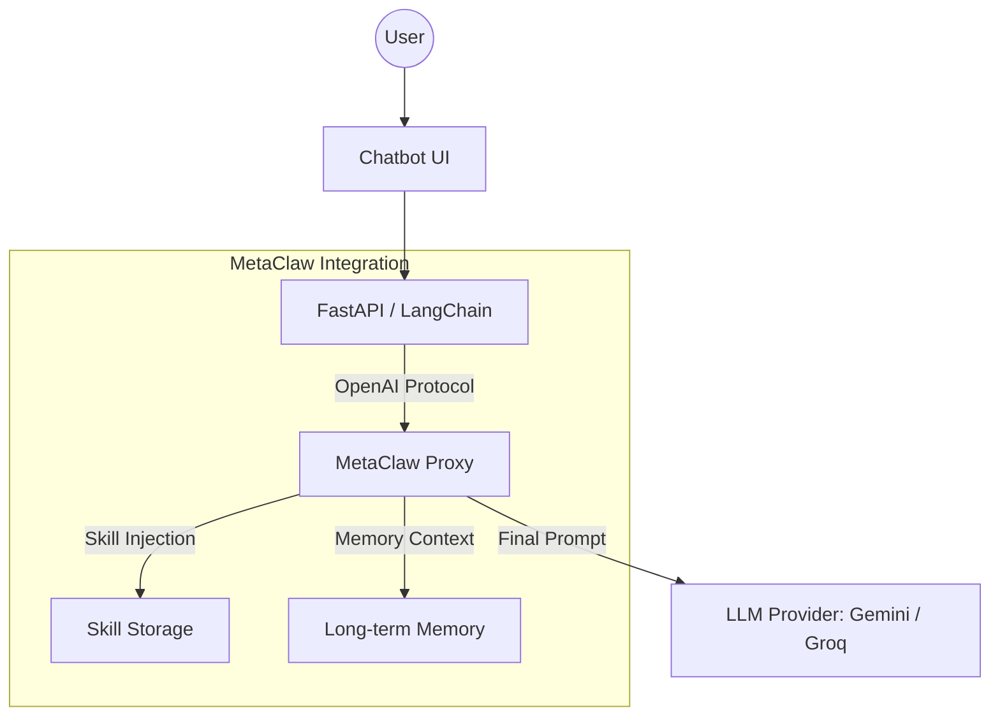
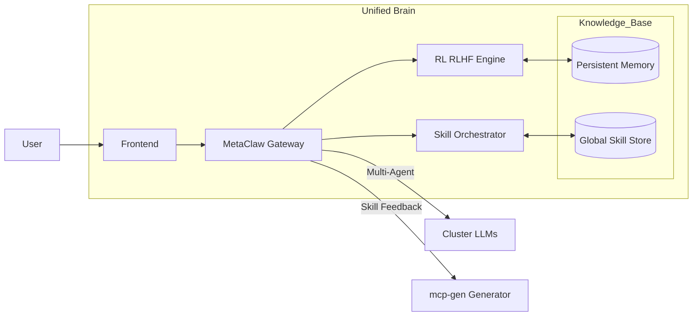

# MetaClaw Learning Proxy Integration

Tài liệu này ghi lại lộ trình tích hợp MetaClaw vào hệ thống Chatbot MCP hiện tại và các kiến trúc mục tiêu.

## 1. Lộ trình tích hợp (Phases & Step-by-step)

### Phase 1: LLM Proxy Integration (OpenAI-Compatible)

_Mục tiêu: Thiết lập lớp proxy để Agent có thể giao tiếp với LLM thông qua MetaClaw._

- [x] **Backend Integration**: Thêm provider `metaclaw` vào `main.py` sử dụng adapter `ChatOpenAI`.
- [x] **Dependency**: Bổ sung `langchain-openai` vào `requirements.txt`.
- [x] **Env Config**: Thêm `METACLAW_API_KEY` và `METACLAW_BASE_URL` vào `.env.example`.
- [x] **Frontend UI**: Thêm tùy chọn MetaClaw vào Chat Settings và cập nhật `MODEL_CONFIG`.
- [x] **Type Safety**: Cập nhật `ChatSettings` interface trong `types.ts`.
- [ ] **Local Setup**:
  - Cài đặt MetaClaw: `pip install -e ".[evolve]"`
  - Khởi tạo: `metaclaw setup`
  - Chạy proxy: `metaclaw start --mode skills_only --port 30000`

### Phase 2: Skill Sync Bridge

_Mục tiêu: Tự động hóa việc đưa các skill sinh ra từ `mcp-gen` vào MetaClaw._

- [ ] **Bridge Script**: Viết script `metaclaw-bridge.py` để đọc file từ thư mục skills của dự án.
- [ ] **Format Conversion**: Chuyển đổi tool/prompt templates sang định dạng YAML của MetaClaw.
- [ ] **Sync Logic**: Sao chép các file đã chuyển đổi vào `~/.metaclaw/skills/`.
- [ ] **Auto-Reload**: Đảm bảo MetaClaw nhận diện skill mới mà không cần restart (nếu hỗ trợ) hoặc trigger reload.

### Phase 3: Memory & RL (Continuous Evolution)

_Mục tiêu: Kích hoạt khả năng ghi nhớ dài hạn và học từ phản hồi người dùng._

- [ ] **Persistence**: Cấu hình MetaClaw sử dụng Database (SQLite/PostgreSQL) để lưu trữ hội thoại.
- [ ] **Feedback Loop**:
  - Frontend: Thêm nút Like/Dislike cho mỗi tin nhắn.
  - Backend: Gửi tín hiệu feedback về MetaClaw thông qua header hoặc endpoint riêng.
- [ ] **RL Training**: Thiết lập MetaClaw chạy background job để tinh chỉnh (fine-tune) prompt/skill dựa trên feedback tích lũy.
- [ ] **Knowledge Graph**: (Optional) Kết nối MetaClaw với Vector DB để cung cấp RAG thông qua Proxy layer.

---

## 2. Kiến trúc Mục tiêu - Option A (Proxy Layer)

_Kiến trúc hiện tại đang triển khai._

**Đặc điểm:**

- **Dễ triển khai:** Chỉ cần đổi `base_url` và `api_key` trong Backend.
- **Tính trong suốt:** LangChain Agent không cần biết về sự tồn tại của MetaClaw.
- **Skill Injection:** MetaClaw tự động chèn thêm "Kỹ năng" vào prompt trước khi gửi đến LLM.

---

## 3. Kiến trúc Scale-up - Option C (Unified Agent Brain)

_Kiến trúc hướng tới trong tương lai._

**Đặc điểm:**

- **Trung tâm hóa (Centralized):** MetaClaw không chỉ là proxy mà trở thành "Hệ điều hành" của Agent.
- **Vòng lặp tiến hóa (Self-Evolution):**
  - Agent tương tác với User → Kết quả trả về được đánh giá.
  - MetaClaw học từ feedback đó qua RL (Reinforcement Learning).
  - Tự động gọi `mcp-gen` để sinh ra Skill mới hoặc tối ưu Skill cũ.
- **Hỗ trợ đa dự án:** Một cụm MetaClaw có thể phục vụ nhiều Frontend/Backend khác nhau, chia sẻ chung bộ nhớ và kỹ năng.

---

## 4. Ghi chú kỹ thuật

- **Port:** MetaClaw mặc định chạy tại `30000`.
- **Compatibility:** Luôn tuân thủ chuẩn OpenAI Chat Completions để đảm bảo tính hoán đổi.
- **Skill Storage:** Tọa lạc tại `~/.metaclaw/skills/`.
